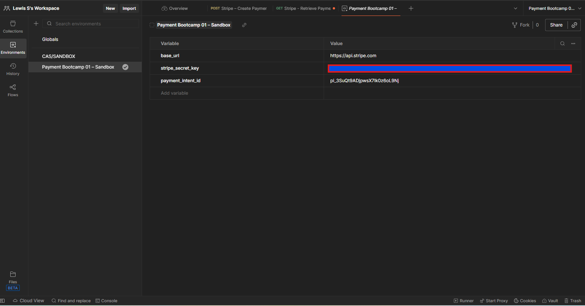

# Postman Fundamentals (Day 2–3) — Payment Bootcamp 01

## What I practiced (Day 2: Postman basics)
- Built and organized requests inside a Postman collection
- Used common HTTP methods for API integrations (GET and POST)
- Worked with:
  - URL paths and parameters
  - Headers and Authorization (Bearer token)
  - Request bodies (x-www-form-urlencoded for Stripe)
- Inspected responses:
  - Status codes (200 OK vs 400 errors)
  - Response JSON structure and key fields (id, amount, currency, livemode)

## What I experienced (real integration notes)
- Successfully created a Stripe PaymentIntent (POST) and retrieved it by ID (GET).
- Encountered a 400 error caused by hidden or forbidden characters introduced through copy/paste or variable resolution.
- Resolved the issue by retyping the URL cleanly and confirming a stable workflow:
  - Create PaymentIntent → capture returned `pi_...` ID → Retrieve PaymentIntent
- Key real-world takeaways:
  - Minor formatting issues can break API calls even when credentials are correct.
  - Postman environments and variables make demos repeatable and reduce errors when switching between requests.

## Day 2 Screenshots (Collections + Request/Response)

**Collection overview (requests organized in a collection):**  

**GET Retrieve PaymentIntent — 200 OK with JSON response:**  

## Day 3 Screenshots (Variables + Environments)

**Environment variables used for a repeatable demo:**  

