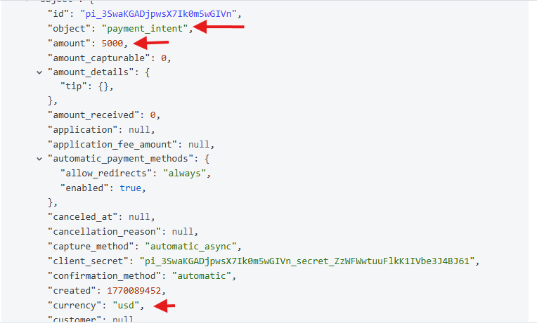

# Fraud Signals & Frictionless Payments (Day 6)

## Goal
Understand how fraud signals are represented in payment events and how platforms use those signals to enable frictionless payment flows.

---

## Fraud signals observed in Stripe Events
The `payment_intent.created` event contains core transaction context, including:
- amount and currency
- payment method type
- merchant account context
- optional customer and billing information
- optional merchant-provided metadata

These fields form the foundation for risk evaluation.

---

## Signals not present in test mode
In Stripe test mode, certain real-world signals are not present, including:
- device fingerprinting
- IP reputation
- browser and behavioral data
- historical customer velocity

In production, these signals are enriched through client-side integrations and network data.

---

## Frictionless decisioning model
Payment platforms aim to keep legitimate transactions frictionless by:
- allowing low-risk transactions to proceed silently
- applying step-up authentication only when confidence is low
- blocking or reviewing transactions that exceed risk thresholds

The stronger and more consistent the signals, the less friction is required.

---

## Sales Engineer perspective
Frictionless payments are not about removing security — they are about applying security intelligently. Effective fraud systems balance loss prevention with conversion optimization by escalating only uncertain transactions.

---

## Screenshot

