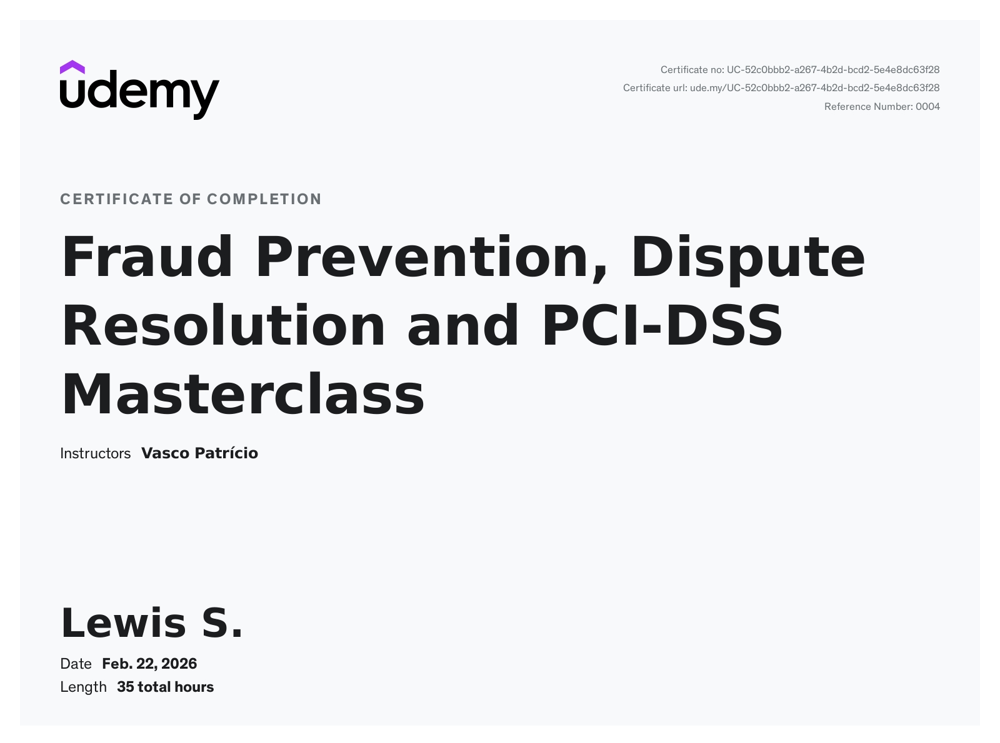

# 🎓 Professional Development: Payments & Fraud

## Fraud Prevention, Dispute Resolution, and PCI-DSS Masterclass
**Instructor:** Vasco Patrício | **Status:** Completed Feb 2026

### 🏆 Certification

### 🧠 Core Competencies Gained:
* **PCI-DSS Framework:** Mastery of the 12 requirements and the transition from v3.2.1 to v4.0.
* **Fraud Strategy:** Implementing velocity checks, geolocation tracking, and behavioral fingerprints to mitigate "Carding" and "Account Takeover" (ATO).
* **Chargeback Management:** Navigating the Representment process and the mechanics of the "Liability Shift" under 3DS 2.0.
* **Compliance:** Specialized knowledge in Merchant Scope Reduction via Tokenization.
