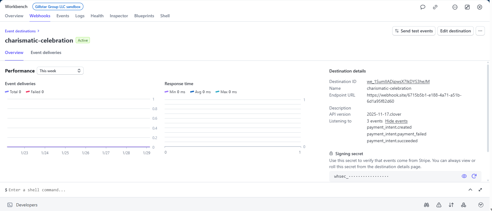
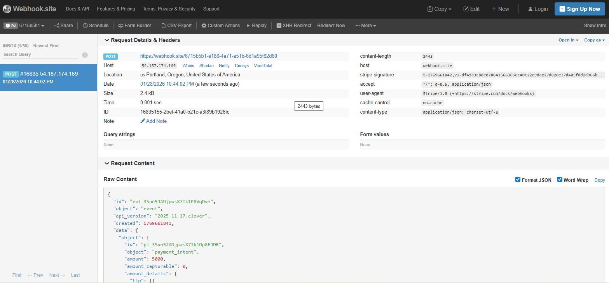

# Stripe Webhooks – Event-Driven Payments (Day 4)

## Goal
Validate an event-driven payment workflow by receiving real Stripe events via webhook (HTTP POST) and inspecting the JSON payload.

## Setup
- Stripe account: Sandbox/Test mode
- Webhook receiver: Webhook.site
- Subscribed events:
  - payment_intent.created
  - payment_intent.succeeded
  - payment_intent.payment_failed

## What I validated
- Stripe delivered an event to the webhook endpoint as an HTTP POST request
- The payload included:
  - Event ID (evt_...)
  - Event type (e.g., payment_intent.created)
  - The full PaymentIntent object under data.object (pi_...)
- Stripe included a `stripe-signature` header, which is used to verify authenticity of the webhook request

## Sales Engineer takeaway
Webhooks are the real-time backbone of payment integrations. This pattern is how merchants and platforms trigger downstream actions such as:
- fraud and risk checks
- customer notifications
- fulfillment and order management
- dispute and refund automation

## Screenshots

