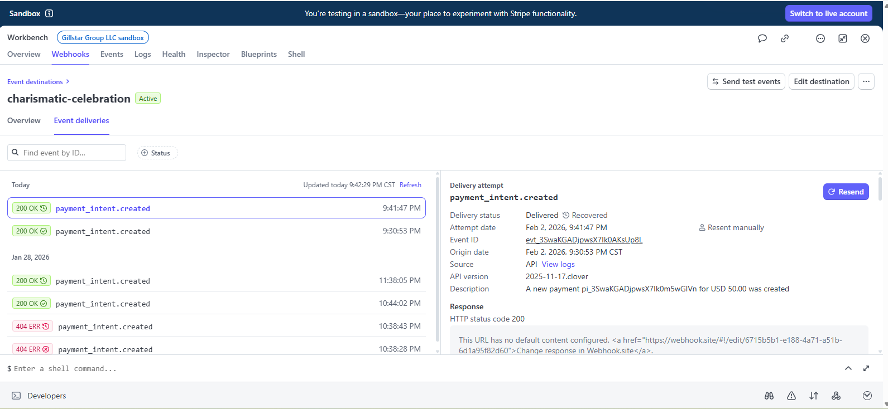
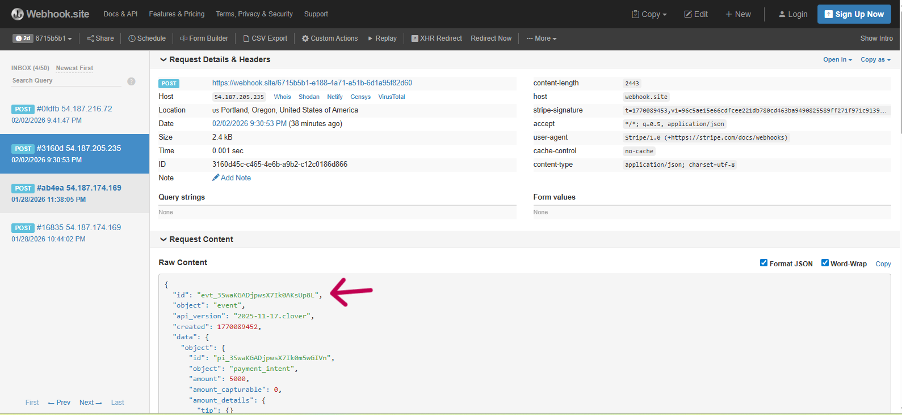
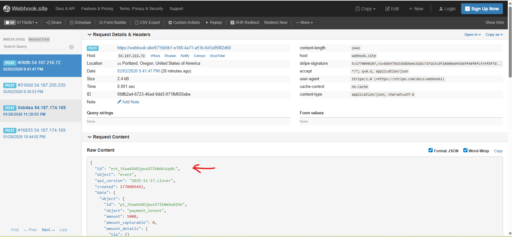

# Webhook Reliability, Retries & Replay (Day 5)

## Goal
Demonstrate how Stripe delivers webhook events using at-least-once delivery semantics, how retries and replay work, and why downstream systems must be idempotent to prevent duplicate processing.

---

## What I worked on
- Observed real webhook delivery attempts in the Stripe Dashboard
- Triggered new payment events via the Stripe API
- Replayed an existing webhook event on demand
- Verified duplicate deliveries arriving at the webhook receiver
- Documented why duplicate events are expected and how systems safely handle them

---

## Key observations

### At-least-once delivery
Stripe guarantees that webhook events will be delivered **at least once**, not exactly once.  
If Stripe does not receive a successful (2xx) response, it will retry delivery.

### Retries and replay
- Failed deliveries are retried automatically by Stripe
- Previously delivered events can be replayed manually
- Replayed events contain the **same event ID (`evt_...`)** and payload

### Idempotency requirement
Because the same event can be delivered more than once, webhook consumers must:
- Track processed event IDs
- Check before performing side effects
- Ensure duplicate events do not trigger duplicate charges, refunds, or ledger entries

---

## Why this matters in payments & fraud systems
Reliable event delivery is critical for:
- Fraud and risk decision workflows
- Order fulfillment and inventory updates
- Customer notifications
- Accounting and ledger accuracy

At-least-once delivery increases reliability across network failures, while idempotent processing protects the business from duplicate financial actions.

---

## Screenshots

### Stripe Webhook Delivery Attempts
This screenshot shows Stripe’s Event deliveries log, including successful deliveries and replayed attempts for the same event.

---

### Webhook Replay – First Delivery
This screenshot shows the original webhook delivery received by the webhook endpoint, including the event ID and PaymentIntent payload.

---

### Webhook Replay – Replayed Delivery
This screenshot shows the same Stripe event being delivered again after replay, with the **same event ID**, demonstrating at-least-once delivery behavior.

---

## Sales Engineer takeaway
Webhook retries and replay are not edge cases — they are expected behavior in distributed payment systems.  
Understanding and explaining idempotency, event replay, and duplicate handling is essential when supporting merchants, financial institutions, and fraud platforms in production environments.
